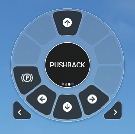

# Flow Pushback
Script para uso no Microsoft Flight Simulator 2020 juntamente com o addon FLOW da Parallel42.
Criado por Judenilson Araujo Silva

## Instalação

- Copie a pasta dentro do diretório Community do seu simulador.

## Updates 

### v1.2
- Removido puxar para trás dos botões esquerda e direita
- Implementado acionar dois botões para fazer curva
- Adicionado parada suave ao movimentar.

### v1.1
- Parking brake adicionado ao pacote.
